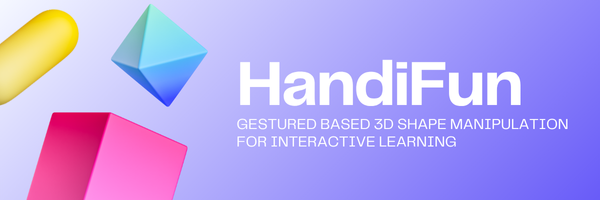

An interactive learning tool that allows users to manipulate 3D shapes using hand gestures in real time. With the help of a webcam or motion sensor, it tracks hand movements and translates them into commands for rotating, resizing, or reshaping 3D objects. This makes learning geometry and spatial visualization more engaging, especially for students in fields that rely heavily on 3D concepts.

## 💡 Purpose
The purpose of **HandiFun** is to make the study of geometry and design more fun, interactive, and practical. Instead of relying only on books or mouse controls, students can directly interact with 3D objects using natural hand gestures. This is particularly helpful for engineering and architecture students, since their courses require strong visualization and manipulation of 3D models.

## ✨ Key Features

- **Gesture Recognition:** Detects hand movements through a webcam or sensor.
- **3D Shape Manipulation:** Rotate, resize, and reshape 3D objects in real time.
- **User-friendly Interface:** Simple and intuitive, making it accessible to all learners.
- **Real-time Feedback:** Instant system response for smooth interaction.
- **Educational Integration:** Useful not only for general math learning but also for engineering and architecture students who need to practice spatial and design skills.

